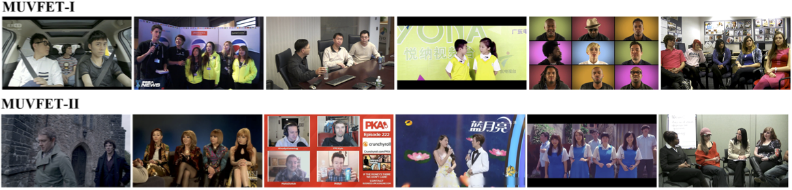

# Predicting Salient Face in Multiple-face Videos

*Although the recent success of convolutional neural network
(CNN) advances state-of-the-art saliency prediction in
static images, few work has addressed the problem of predicting
attention in videos. On the other hand, we find that
the attention of different subjects consistently focuses on a
single face in each frame of videos involving multiple faces.
Therefore, we propose in this paper a novel deep learning
(DL) based method to predict salient face in multiple-face
videos, which is capable of learning features and transition
of salient faces across video frames. In particular, we first
learn a CNN for each frame to locate salient face. Taking
CNN features as input, we develop a multiple-stream long
short-term memory (M-LSTM) network to predict the temporal
transition of salient faces in video sequences. To evaluate
our DL-based method, we build a new eye-tracking
database of multiple-face videos. The experimental results
show that our method outperforms the prior state-of-the-art
methods in predicting visual attention on faces in multipleface
videos*

## MUVFET

**MUltiple-Face Videos with Eye Tracking fixations (MUFVET)**. All videos in MUFVET
are with either indoor or outdoor scenes, selected from Youtube
and Youku, and they are all encoded by H.264 with
duration varying from 10-20 seconds. Besides, MUFVET
includes two datasets – MUFVET-I and MUFVET-II. These
two datasets are comprised by two non-overlapping groups
of videos, each of which is viewed by totally different subjects.

We think both training and test utilize the fixations of same subjects are not rationale in existing saliency prediction works, despite videos being different. So MUFVET-I is seen as the benchmark for test, while MUFVET-II is used for training.

## Experiments
| Method | Network | Training Data | Testing Data | Reference | Result |
| :----- | :------ | :------------ | :----------- | :-------: | :----: |
| Fast R-CNN | VGG16 | VOC07 | VOC07test | 66.9 | 66.50 |
| Fast R-CNN | VGG16 | VOC07 | VOC07test | 66.9 | 66.50 |
| Fast R-CNN | VGG16 | VOC07 | VOC07test | 66.9 | 66.50 |
| Fast R-CNN | VGG16 | VOC07 | VOC07test | 66.9 | 66.50 |
| Fast R-CNN | VGG16 | VOC07 | VOC07test | 66.9 | 66.50 |
| Fast R-CNN | VGG16 | VOC07 | VOC07test | 66.9 | 66.50 |
